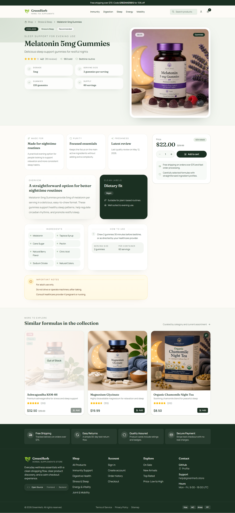
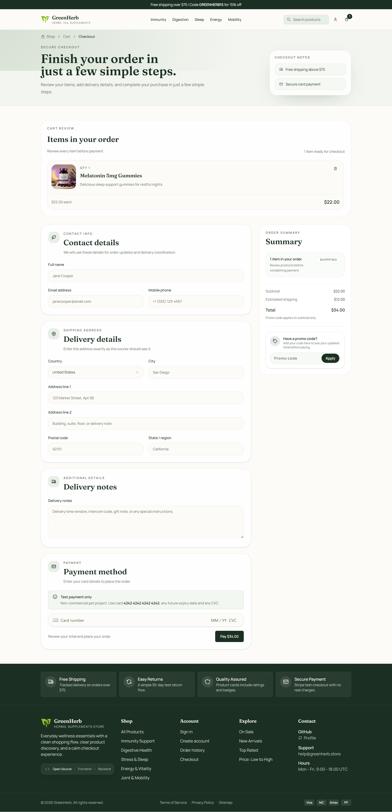

# GreenHerb Backend

Backend ecommerce API for the GreenHerb storefront, built with ASP.NET Core and EF Core.

The project was built around the same constraint as the paired frontend: catalog browsing should stay fast, auth should survive refreshes without leaking session state into every request path, carts should survive the jump from guest to signed-in state, and checkout totals should come from the backend instead of client-side guesses. This repository keeps product search, auth sessions, cart state, checkout pricing, Stripe payment orchestration, and order history on the server so the storefront can stay thin where it matters.

This repository contains the backend application. The frontend lives here:
- [GreenHerb storefront](https://github.com/webdm0/greenherb-frontend)

## Demo

The screenshots below come from the paired storefront that consumes this API.

### Storefront Catalog


<details>
<summary>See the product details page</summary>


</details>

<details>
<summary>See the checkout flow</summary>


</details>

### Live Demo

The production build is hosted and open for evaluation. You can test the full e-commerce flow.

- Live app: [View live demo](https://greenherb-workspace.vercel.app/)

> The backend runs on free-tier hosting and may take up to about a minute to wake up after inactivity.

## What's In The App

- layered `Api -> Application -> Infrastructure -> Domain` solution on .NET 8
- product catalog API with search, sorting, category/form/dietary/availability filters, faceted counts, pagination, slug lookup, and active-slug export
- seeded catalog pipeline backed by [`products.catalog.json`](./src/GreenHerb.Infrastructure/Persistence/Seed/products.catalog.json) with 56 products
- register, login, logout, refresh-session rotation, current-session lookup, and bearer-authenticated `/api/auth/me`
- Google sign-in with backend ID-token verification and external identity linking
- refresh token sessions stored in the database and issued through an `HttpOnly` cookie
- signed `__session_hint` cookie for the frontend proxy layer to validate session hints before page load
- authenticated cart persistence with add, update, remove, clear, and guest-cart merge flows
- checkout quote, payment-intent creation, payment completion, promo-code validation, and server-owned shipping/discount totals
- Stripe webhook handling that marks orders as paid and clears the cart after successful payment
- paid order history with order-item snapshots, including stored product name, slug, SKU, and image URL
- `healthz` endpoint and static product image hosting from `wwwroot`

## Why It Was Built This Way

- `Access token + refresh cookie split`: the API returns a short-lived JWT for protected requests, while long-lived refresh state is stored as hashed database sessions and rotated on refresh.
- `Frontend-aware session hints`: the backend also issues a signed `__session_hint` cookie so the Next.js proxy in the frontend can cheaply validate whether a refresh-backed session is probably still valid before loading protected pages.
- `Cart continuity across auth states`: guest cart items can be sent during registration, password login, or Google login, and the backend merges them into the server cart instead of replacing it.
- `Checkout totals stay server-owned`: subtotal, promo discount, shipping, total amount, and Stripe PaymentIntent amount are computed on the server and validated again before an order is marked paid.
- `Order history survives catalog drift`: orders store product snapshots, including name, slug, SKU, unit price, and image URL, so history does not depend on live catalog rows staying unchanged forever.
- `Catalog behavior stays backend-owned`: filtering, sorting, facet counts, slug lookup, and pagination are implemented in the API so the frontend consumes one consistent catalog contract.
- `Structure under ecommerce complexity`: controller code stays thin, application services own business rules, infrastructure owns EF Core and auth providers, and the domain layer holds entities and validation rules.

## Stack

- ASP.NET Core 8 Web API
- C# / .NET 8
- Entity Framework Core 8 with PostgreSQL (`Npgsql`)
- JWT bearer auth
- refresh-session persistence in PostgreSQL
- BCrypt password hashing
- Google ID token verification through Google OIDC metadata and JWKS
- Stripe.net for payment intents, promo-code validation, and webhooks
- xUnit integration and unit tests
- Docker Compose for local PostgreSQL
- multi-stage Docker build for container deployment

## Where To Look In Code

- [`src/GreenHerb.Api/Program.cs`](./src/GreenHerb.Api/Program.cs): app bootstrap, auth/cookie/Stripe configuration, CORS, static files, and startup catalog seeding
- [`src/GreenHerb.Application/Features/Auth/Services/AuthService.cs`](./src/GreenHerb.Application/Features/Auth/Services/AuthService.cs): registration, login, Google auth, refresh-session rotation, and guest-cart merge at auth time
- [`src/GreenHerb.Api/Services/SessionHintService.cs`](./src/GreenHerb.Api/Services/SessionHintService.cs): signed `__session_hint` cookie generation for the frontend proxy
- [`src/GreenHerb.Application/Features/Cart/Services/CartService.cs`](./src/GreenHerb.Application/Features/Cart/Services/CartService.cs): server cart CRUD and authenticated merge behavior
- [`src/GreenHerb.Application/Features/Checkout/Services/CheckoutService.cs`](./src/GreenHerb.Application/Features/Checkout/Services/CheckoutService.cs): pricing snapshot creation, shipping rules, order creation, payment validation, and cart clearing after payment
- [`src/GreenHerb.Api/Services/StripePromotionService.cs`](./src/GreenHerb.Api/Services/StripePromotionService.cs): Stripe promotion-code lookup and discount validation
- [`src/GreenHerb.Api/Controllers/StripeWebhookController.cs`](./src/GreenHerb.Api/Controllers/StripeWebhookController.cs): Stripe signature verification and `payment_intent.succeeded` handling
- [`src/GreenHerb.Application/Features/Products/Services/ProductCatalogService.cs`](./src/GreenHerb.Application/Features/Products/Services/ProductCatalogService.cs): catalog search, filters, sorting, badges, and facet calculation
- [`src/GreenHerb.Infrastructure/Persistence/AppDbContext.cs`](./src/GreenHerb.Infrastructure/Persistence/AppDbContext.cs): EF Core mappings plus normalization of user, product, identity, cart, and order fields before save
- [`src/GreenHerb.Infrastructure/Persistence/Seed/ProductSeeder.cs`](./src/GreenHerb.Infrastructure/Persistence/Seed/ProductSeeder.cs): JSON catalog import on startup when seeding is enabled
- [`tests/GreenHerb.IntegrationTests/CustomWebApplicationFactory.cs`](./tests/GreenHerb.IntegrationTests/CustomWebApplicationFactory.cs): integration-test host, isolated PostgreSQL databases, and runtime config overrides

For environment and secret management details, see [`CONFIGURATION.md`](./CONFIGURATION.md).

## Running It Locally

This backend is meant to run together with the frontend repository.

1. Install the .NET 8 SDK and start PostgreSQL:

```bash
docker compose up -d
```

2. Create `.env` from [`.env.example`](./.env.example).
3. Fill the required values:
- `ConnectionStrings__DefaultConnection`
- `Jwt__Key`
- `SessionHint__Key`
- `Authentication__Google__ClientIds__0`
- `Stripe__SecretKey`
- `Stripe__WebhookSecret`
- `FrontendSettings__RevalidateSecret`
4. Set `AllowedOrigins__0` and `FrontendSettings__RevalidateUrl` to the frontend origin you use locally, for example `http://localhost:3000`.
5. Set `SessionHint__Key` to a secret value different from `Jwt__Key`.
6. Restore dependencies, apply the EF Core migrations, and start the API:

```bash
dotnet restore ./GreenHerb.sln
dotnet ef database update --project src/GreenHerb.Infrastructure --startup-project src/GreenHerb.Api
dotnet run --project src/GreenHerb.Api
```

Then start the frontend by following the setup in the [storefront repository](https://github.com/webdm0/greenherb-frontend).

Default local URLs:
- API: `http://localhost:5187`
- Frontend: `http://localhost:3000`

Container build and run:

```bash
docker build -t greenherb-api .
docker run --rm -p 10000:10000 --env-file .env greenherb-api
```

Example environment variables:

```env
POSTGRES_DB=greenherb_dev
POSTGRES_USER=greenherb
POSTGRES_PASSWORD=greenherb
POSTGRES_PORT=5432

ConnectionStrings__DefaultConnection=Host=localhost;Port=5432;Database=greenherb_dev;Username=greenherb;Password=greenherb
Jwt__Key=change-me-dev-only-jwt-key-please-1234567890
Jwt__Issuer=GreenHerb.Api
Jwt__Audience=GreenHerb.Frontend
Jwt__AccessTokenMinutes=15
Jwt__RefreshTokenDays=7
Jwt__MaxSessions=5
SessionHint__Key=change-me-session-hint-key-please-0987654321
SessionHint__TtlSeconds=604800
SessionHint__Issuer=GreenHerb.Api
SessionHint__Audience=GreenHerb.Frontend
Authentication__Google__ClientIds__0=your-google-client-id.apps.googleusercontent.com
Stripe__SecretKey=sk_test_change_me
Stripe__WebhookSecret=whsec_change_me
Cookies__UseCrossSiteAuth=false
Cookies__UseSecureAuthCookies=false
CatalogSeed__OnStartup=true
AllowedOrigins__0=http://localhost:3000
```

Optional environment variables:
- `Jwt__AccessTokenMinutes`, `Jwt__RefreshTokenDays`, and `Jwt__MaxSessions` to tune token lifetime and per-user session limits
- `SessionHint__TtlSeconds`, `SessionHint__Issuer`, and `SessionHint__Audience` for stricter frontend session-hint validation
- `Cookies__UseCrossSiteAuth=true` only when the browser calls the backend directly from another site
- `Cookies__UseSecureAuthCookies=true` when secure cookies are required outside plain local HTTP
- `CatalogSeed__OnStartup=true` to import the JSON catalog automatically when the product table is empty
- `FrontendSettings__RevalidateUrl` and `FrontendSettings__RevalidateSecret` for frontend cache revalidation after catalog changes
- `ASPNETCORE_FORWARDEDHEADERS_ENABLED=true` when the app runs behind a reverse proxy that forwards scheme and client IP headers
- `PORT` to bind the app to `http://0.0.0.0:<PORT>` in hosted environments

Environment notes:
- `ConnectionStrings__DefaultConnection`: PostgreSQL connection used by EF Core and migrations
- `Jwt__Key`, `Jwt__Issuer`, and `Jwt__Audience`: access-token signing and validation
- `SessionHint__Key`: signing key for the backend-issued `__session_hint` cookie used by the frontend proxy
- `Authentication__Google__ClientIds__0`: allowed Google OAuth client ID for backend ID-token verification
- `Stripe__SecretKey`: Stripe API access for payment intents and promo-code validation
- `Stripe__WebhookSecret`: Stripe signature verification for [`src/GreenHerb.Api/Controllers/StripeWebhookController.cs`](./src/GreenHerb.Api/Controllers/StripeWebhookController.cs)
- `AllowedOrigins__0`: frontend origin allowed by CORS

Configuration constraints:
- `SessionHint__Key` must be different from `Jwt__Key`
- `Cookies__UseCrossSiteAuth=true` requires `Cookies__UseSecureAuthCookies=true`

Quality checks:

```bash
dotnet build ./GreenHerb.sln -c Release --no-restore
dotnet test ./GreenHerb.sln -c Release --no-build --no-restore
```

Integration tests use PostgreSQL and can read configuration from `ConnectionStrings__DefaultConnection`, `IntegrationTests__DefaultConnection`, or the local `.env`.

## Notes

- GreenHerb is a fictional storefront brand used to give the catalog, auth, cart, and checkout flows a consistent commerce context.
- The backend and frontend were designed together. The frontend proxy/session-recovery flow in `/home/blood/project/greenherb-frontend` depends on the backend `refreshToken` cookie and signed `__session_hint` cookie.
- `dotnet test GreenHerb.sln` passes in the current repository state, including 3 unit tests and 23 integration tests.
